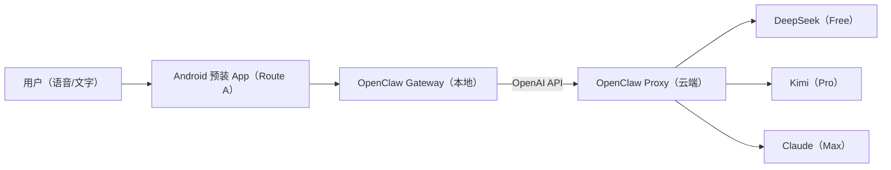

# OpenClaw Mobile (Nana) — Monorepo

面向“**不会配置的人**”的移动端 OpenClaw 方案：把 **系统级预装 Android App（Route A）**、**内置语音聊天 UI**、**出厂预置 device_token**、以及 **OpenAI-compatible Proxy（DeepSeek/Kimi/Claude 三档）** 全部整合在一个仓库里，目标是让用户只需要“点一下说话”。

## 你会得到什么
- **Route A 预装 App**：用系统级预装（或出厂流程）把运行环境、安装、配置都自动化，隐藏 Termux/终端
- **内置聊天 UI（语音）**：老大妈只看见一个大麦克风按钮，默认语音输入 + TTS 播报
- **device_token 出厂预置**：端侧不存任何上游模型厂商 key；只存设备 token，订阅/限额/路由全部在云端做
- **OpenAI-compatible Proxy**：统一 `POST /v1/chat/completions`，按 token 档位路由：
  - Free → DeepSeek（省成本）
  - Pro → Kimi（长上下文）
  - Max → Claude（更强稳定性）

## 架构（高层）


## 仓库结构
- `android/botdrop-android/`：Android 预装 App（基于 BotDrop fork，含 Route A 预装 + 内置语音聊天 UI）
- `proxy/`：OpenAI-compatible Proxy（按 device_token tier 路由 DeepSeek/Kimi/Claude，含限额/降级骨架）
- `PREINSTALL_MOMS.md`：3 万台出厂预装方案（老大妈用户）
- `OPENCLAW_MOBILE_DETAILED_PLAN.md`：详细计划（域名/限额/订阅/风控/路线图）
- `IDIOTPROOF_PLAN.md`：从“能跑”到“傻瓜可用”的可执行 checklist
- `factory_provision_adb.sh`：出厂 ADB provisioning 模板
- `install-nanabot.sh`：Termux/Android 兜底安装脚本（路线 B / 调试）

## 快速验证（本机）

### Proxy（无上游 key 也能跑通链路）
```bash
cd proxy
MOCK_MODE=1 ADMIN_KEY=devadmin LISTEN_PORT=8080 ./run_dev.sh
./smoke_test.sh http://127.0.0.1:8080
```

### Android（需要 JDK 17 + Android SDK）
```bash
cd android/botdrop-android
./gradlew testDebugUnitTest
./gradlew assembleDebug
```

## 致敬与来源
本仓库的 Route A 预装链路来自我们对开源项目的学习与二次开发，详见：
- `ACKNOWLEDGEMENTS.md`
- `INTEGRATION_SOURCES.md`

## 许可证
本仓库以 **GPLv3** 发布（根目录 `LICENSE`）。其中 `android/botdrop-android/` 也包含其上游许可文件与声明。

## Legacy Mirrors（可忽略）
历史上曾拆分为多个 repo；现在以本 monorepo 为准。旧 repo 仅保留兼容指向：
- https://github.com/howardleegeek/botdrop-android
- https://github.com/howardleegeek/openclaw-proxy
